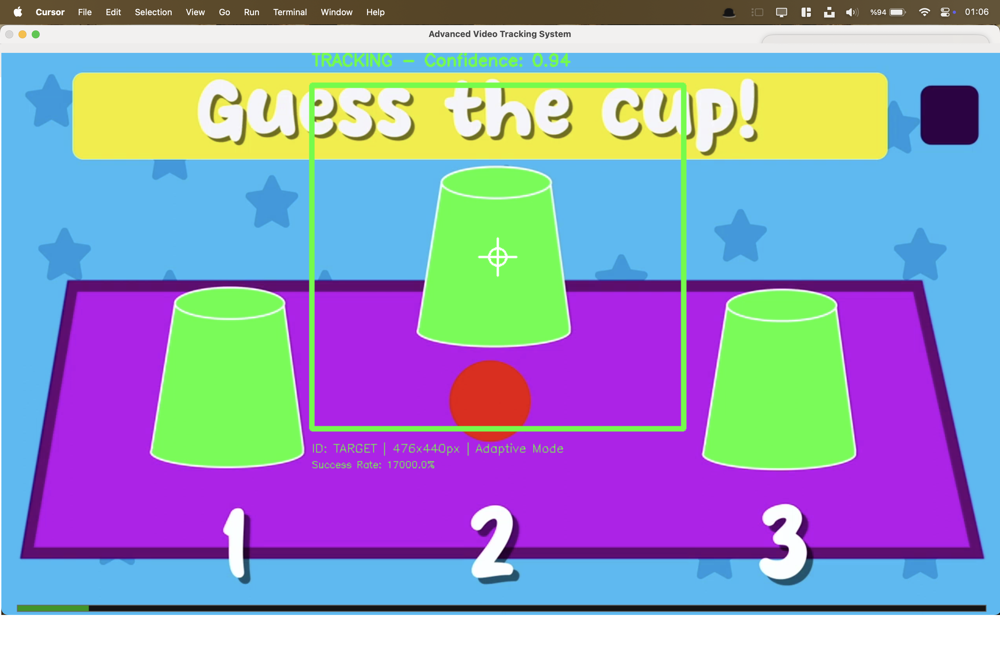
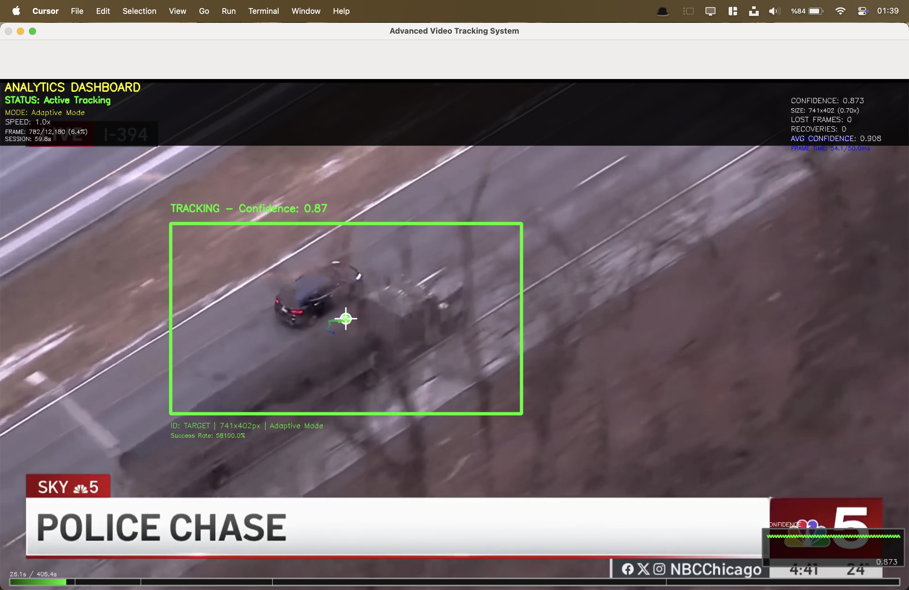

# 🎯 StickOnTarget – Akıllı Video Takip Sistemi

Gerçek zamanlı, kullanıcı seçimine dayalı nesne takibi yapan Python tabanlı sistem. Hedef kaybolsa bile tahmin yürütür, bekler ve yeniden takibe başlar.

## 🚀 Özellikler
- 🎯 Seçilen nesneye "yapışan" hedef kutusu
- 🔄 Görsel kayıp durumunda konum tahmini
- 🤖 Adaptif takip modu (AI destekli)
- 📊 FPS, güven analizi ve iz geçmişi
- 🎥 Video üzerinde canlı çizim ve kontrol

## ⚙️ Kurulum
```bash
git clone https://github.com/kullaniciadi/StickOnTarget.git
cd StickOnTarget
pip install -r requirements.txt
python enhanced_video_tracker.py [video.mp4]

```

### Gerekli Paketler
```
opencv-python>=4.5.0
numpy>=1.19.0
```

## Kullanım

### Temel Kullanım
```bash
# Video dosyası ile çalıştırma
python enhanced_video_tracker.py video_dosyasi.mp4

# Varsayılan video ile çalıştırma
python enhanced_video_tracker.py
```
## 🧠 Advanced Video Tracking System – Görsel Örnekler

> Bu bölümde sistemin farklı senaryolardaki performansını gösteren ekran görüntüleri ve GIF animasyonları yer almaktadır.  
> Nesne seçimi, gerçek zamanlı izleme ve tahmine dayalı yeniden yakalama gibi yetenekler açıkça gözlemlenebilir.

---

### 🎯 Nesne Seçimi – Kap Takibi Arayüzü

<p align="center">
  
</p>

---

### 🚗 Gerçek Video Üzerinden Araç Takibi

<p align="center">
  
  
</p>

---

### 🔁 Gerçek Zamanlı Takip – GIF Animasyonları

<p align="center">
  
  
  
  
</p>

---

> 🎯 Sistem, seçilen hedefe kilitlenerek onun boyutuna ve hareketine göre kutuyu adapte eder.
>
> 🔮 Görsel kayıp durumlarında pozisyon tahminiyle hedefin geri dönüşünü bekler ve yeniden takibi otomatik başlatır.
>
> 🧠 Adaptif modlar ve FPS/güven seviyesi izleme özellikleriyle güçlü ve esnek bir takip deneyimi sunar.


### Kontroller

| Tuş | Fonksiyon |
|-----|-----------|
| MOUSE DRAG | Hedef nesne seçimi |
| SPACE | Video oynat/duraklat |
| R | Takibi sıfırla |
| M | Takip modları arasında geçiş |
| A | Analitik paneli aç/kapat |
| T | İz görselleştirme aç/kapat |
| P | Öngörü gösterimi aç/kapat |
| G | Güven grafiği aç/kapat |
| +/- | Oynatma hızını ayarla |
| 1,2,3,4 | Takip modu seç (Hassas/Dengeli/Agresif/Adaptif) |
| Z | Otomatik zoom aç/kapat |
| S | Akıllı kırpma aç/kapat |
| F | Performans modu değiştir |
| O | Adaptif performans aç/kapat |
| L | Hafif mod aç/kapat |
| X | Oklüzyon tespiti aç/kapat |
| ESC | Uygulamadan çık |

## 🧪 Takip Modları
Hassas: Yüksek doğruluk

Dengeli: Orta hız ve kararlılık

Agresif: Zor koşullarda dirençli

Adaptif: Duruma göre otomatik mod seçimi

## 💡 Uygulama Alanları
Güvenlik kameraları ve gözetim

Oyun/simülasyonlarda hedef takibi

Trafik analiz sistemleri

AR/VR uygulamaları

## Performans Ayarları

### Otomatik Performans Optimizasyonu
Sistem otomatik olarak aşağıdaki parametreleri ayarlar:
- **Frame işleme süresi izleme**
- **Performans seviyesi otomatik ayarı**
- **Kaynak kullanımı optimizasyonu**
- **Adaptif algoritma seçimi**


### Sık Karşılaşılan Problemler

| Problem | Çözüm |
|---------|--------|
| Video açılmıyor | Dosya yolunu ve formatını kontrol edin |
| Düşük FPS | Hafif mod açın, çözünürlüğü azaltın |
| Takip başarısız | max_lost_frames artırın, CSRT deneyin |
| Bellek problemi | Diğer uygulamaları kapatın |
| Import hataları | pip install -r requirements.txt çalıştırın |

### Debug Modu
```bash
# Verbose loglama etkinleştir
python enhanced_video_tracker.py --verbose

# OpenCV kurulumunu kontrol et
python -c "import cv2; print(cv2.__version__)"
```

### Proje Yapısı
```
/
├── enhanced_video_tracker.py    # Ana takip uygulaması
├── requirements.txt             # Python bağımlılıkları
├── tracker_config.json          # Konfigürasyon dosyası
├── setup.py                     # Kurulum scripti
├── test_tracker.py              # Test dosyaları
└── README.md                    # Bu dokümantasyon
```

### Geliştirmeye Katkı    

1. **Depoyu fork edin**
2. **Feature branch oluşturun:** `git checkout -b feature/YeniOzellik`
3. **Değişiklikleri commit edin:** `git commit -m 'YeniOzellik eklendi'`
4. **Branch'i push edin:** `git push origin feature/YeniOzellik`
5. **Pull Request açın**
